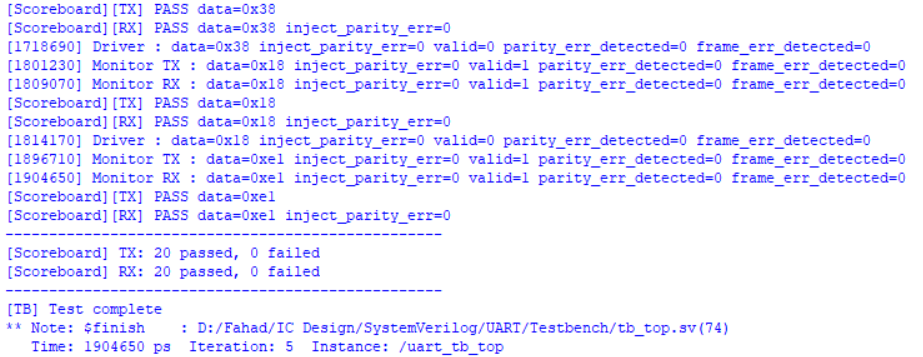
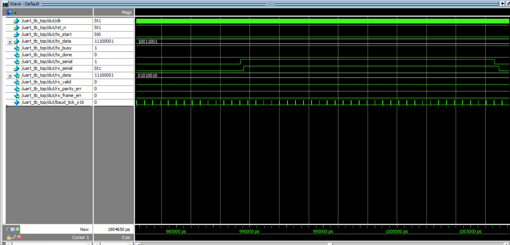

# UART Controller with Layered Testbench

As part of the IC Design Training program, I implemented a UART Controller. UART stands for Universal Asynchronous Receiver-Transmitter and defines a protocol for communication between two devices. In a UART system, the data is received in parallel by the transmitter, sent serially over the shared wire to the receiver, who outputs the data in parallel. Since, it is an asynchronous system, both devices do not share a clock and the data must be sent at the exact same data speed known as the baud rate. 

  

It should be noted that both devices in the system can act as both a transmitter and a receiver as both as TX and RX pins. This is important as this repo represents one chip/device of the UART System and not both. This is evident from the fact that the `tx_serial` output of the transmitter is NOT set as input to the receiver in the `uart_top` file.

## UART Data Packet Format

This is the data packet format followed in this project. Parity Bit can be set to Even/Odd/None. Stop Bit can set to 2 or more as well.

| Start Bit | Data Bits | Parity Bit | Stop Bit |
| :---: | :---: | :---: | :---: |
| `0` (Logic Low) | 8 bits | Even / Odd / None | `1` (Logic High) |

## Clock and Baud Rate
Clock is set to 50,000,000 Hz or 50 MHz. While Baud Rate is set to 115200 bauds. It should be noted that the receiver oversamples by 16 to make sure to get the correct value.

## Layered Testbench
This UART Controller is verified using a layered testbench structure:

  

1) Transaction - class for mainly holding data
2) Interface -  bundle of physical wires connecting testbench and the DUT
3) Generator - generates multiple randomized transactions and pushes them into mailbox
4) Driver - unpacks transaction from mailbox and drives the inputs to the pins on the interface 
5) Monitor - samples the outputs of the DUT
6) Scoreboard - compared expected value (from generator) to the actual values read by the monitor
7) Environment - Instantiates and connects Generator, Driver, Monitor and Scoreboard
8) Test - Instantiates environment

  

<i>Note: The picture above is a portion of the final testbench output. See the entire output in `Simulation/output.txt`</i>

## Waveform
The following is the waveform of the implemented UART Controller. The simulation will remain the same for both Verilog and SystemVerilog. 

  

## How to Run the Code
To run this particular project, it is highly recommended that you use a commercial product like ModelSim/ QuestaSim/ Vivado. Because this project uses OOP constructs (classes and mailboxes), it is NOT possible to run it on EDA playground and it is recommended to use any of the aforementioned software. For example, to run this repo on ModelSim:
1) Open ModelSim and add all sources files.
2) Compile all module and testbench files. (If you used add existing files on a folder with this exact repo structure, then only compile the following files: uart_pkg.sv, uart_baud_gen.sv, uart_tx.sv, uart_rx.sv, tb_top.sv in this EXACT order).
3) Click Simulate on the `tb_top.sv` file.
4) Right-click on dut in the opened left pane and click 'Add Wave'.
5) Click on run -all to see the output
